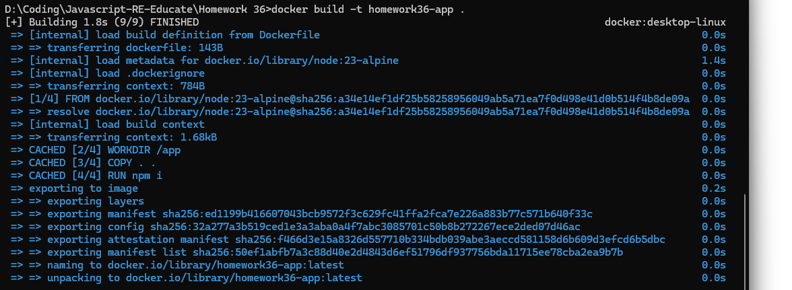
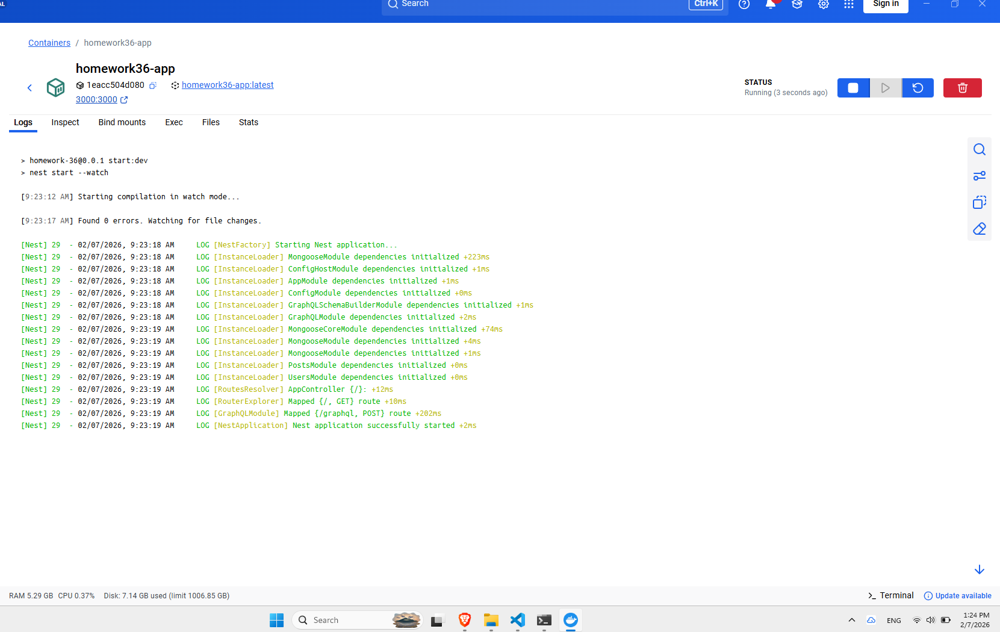
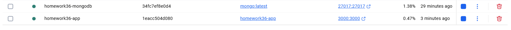
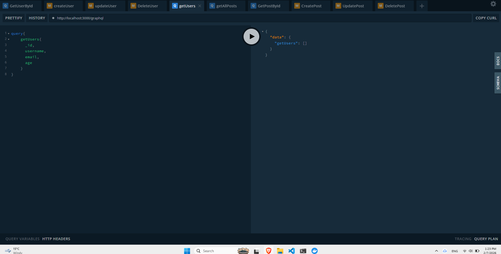

# Homework 36 - NestJS GraphQL API with Docker

## პროექტის აღწერა

NestJS აპლიკაცია GraphQL API-თ და MongoDB ბაზით, Docker კონტეინერებში გაშვებული.

---

## 📸 დასადასტურებელი სქრინშოთები

### 1. Docker Build Process

## **აღწერა:** Docker image-ის აშენების პროცესი ტერმინალში

### 2. Docker Images

**აღწერა:** Docker images-ის სია

- `homework36-app:latest` - ჩვენი აპლიკაციის image
- `mongo:latest` - MongoDB image

---

### 3. Docker PS - Running Containers

**აღწერა:** გაშვებული კონტეინერები ტერმინალში

- `homework36-app` - აპლიკაცია (port 3000)
- `homework36-mongodb` - MongoDB (port 27017)

---

### 4. Application Logs

**აღწერა:** აპლიკაციის ლოგები Docker Desktop-ში

- Nest application successfully started
- MongooseModule dependencies initialized
- GraphQL routes mapped

---

### 5. Docker Desktop - Containers

**აღწერა:** Docker Desktop GUI

- `homework36-mongodb` - Running
- `homework36-app` - Running

---

### 6. GraphQL - Empty Database

**აღწერა:** GraphQL Playground - ცარიელი ბაზა

✅ **დადასტურებულია:** MongoDB ლოკალურად არის გაშვებული და ბაზა ცარიელია
